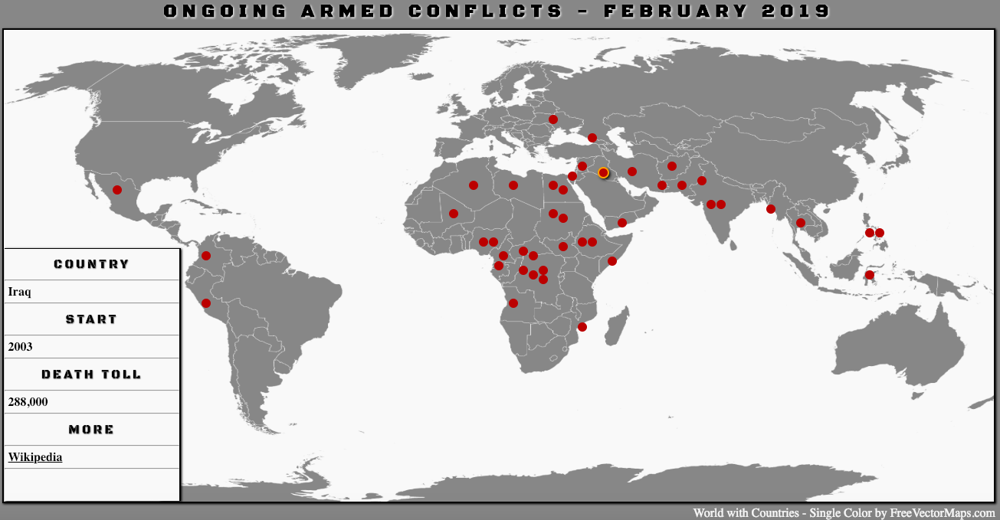

# first_react_project

This project is a map of current armed conflicts in the world. Data comes from [this wikipedia article][article].

  [article]: https://en.wikipedia.org/wiki/List_of_ongoing_armed_conflicts

Click on a dot on the map to learn more about a particular conflict (information is displayed in the table in the left bottom corner, you can click on the link to access a Wikipedia article).

tech stack: JavaScript + React, HTML, Sass

here is how it looks like on the screen:

